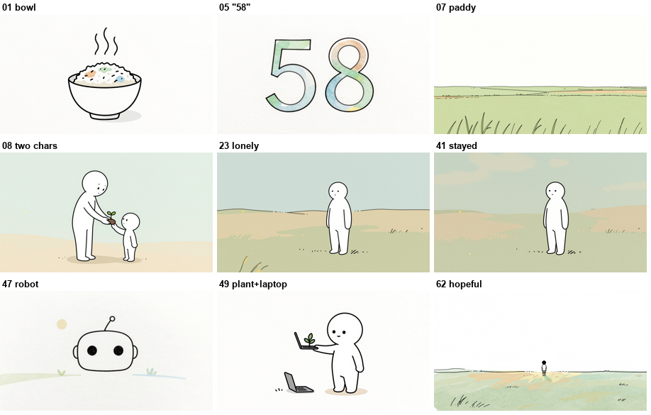

# Soil & Signal — Faceless Video Pipeline

[](https://ko-fi.com/chanuwatsrithong)

Turn a topic into a finished, narrated, thin-line **stickman doodle explainer video** — almost
entirely with **local, free tools**. Built by a self-taught organic farmer in rural Thailand
learning to code, for the YouTube channel **Soil & Signal**.

> An LLM writes the script and the per-scene image prompts. Everything else — image generation,
> speech timing, subtitles, video assembly — runs on your own machine at zero cost.



🎬 Example video: *Why Young People Don't Want to Farm Anymore* (link once uploaded)

---

## How it works

```
TOPIC ──(LLM)──▶ SCRIPT ──(you record)──▶ VOICE ──(Whisper)──▶ PHRASES (captions)
   └─(LLM)─▶ VISUAL BEATS + IMAGE PROMPTS ──(ComfyUI / z-image-turbo)──▶ IMAGES ──(FFmpeg)──▶ VIDEO + .srt
```

Two phases, split by the audio:
- **Phase A** — write the narration (Zen format, one real statistic), then stop.
- **Phase B** — after recording: Whisper timestamps → group phrases into visual beats → 1
  meaning-first image prompt per beat → batch-generate on z-image-turbo → contact-sheet review →
  mux subtitles + music → 16:9 `final.mp4`.

Full walkthrough: [`docs/WORKFLOW.md`](docs/WORKFLOW.md).

## Engineering highlights

- **Audio-driven scene segmentation** — phrases come from the *real* recorded audio (Whisper
  punctuation + pauses), not a pre-guess, so images always sync to the voice. (`whisper_phrases.py`)
- **Visual beats** — captions stay per-phrase, but images group 1-3 phrases into one "beat"
  (one visual idea, 3-6s), which halves generation time and kills the tiny-fragment icon filler.
- **Meaning-first image prompts** — a device menu (literal action / place / contrast / POV /
  stat card / callback…) with anti-icon-slop rules, so each image depicts what the sentence
  *means*, not the nouns it contains. (`skills/script-breakdown/SKILL.md` Phase B)
- **Split style prompt** — `BASE_STYLE` on every scene + `CHARACTER_STYLE` only on character
  scenes, which stops the model from injecting a stick figure into stat cards and landscapes.
- **3-model A/B/C harness** — same prompts across z-image / flux2 / z-image-turbo to pick the
  best speed/quality/consistency tradeoff. (`model_test.py`)
- **One consistent character** — pinned description + fixed seed keep the same doodle figure
  across the whole video.
- **Voice + motion polish** — `clean_voice.py` (denoise + loudness-normalize a real-mic take or
  TTS output), `f5_speak.py` (local F5-TTS voice cloning), and `assemble_clip.py --ken-burns`
  (smooth supersampled slow-zoom, rendered in parallel — a long clip assembles in minutes).

## Tech stack
Python · ComfyUI (z-image-turbo, flux2) · faster-whisper · FFmpeg · Pillow.

## Quickstart
```powershell
# 1. clone, then create your env file
copy .env.example .env        # fill in GEMINI_API_KEY etc.

# 2. install the script-writing skill into Claude Code (optional)
powershell -ExecutionPolicy Bypass -File .\install-skill.ps1

# 3. build a video (see docs/WORKFLOW.md for the full sequence)
python scripts\batch_zturbo.py <slug>
ml-env\Scripts\python.exe scripts\contact_sheet.py <slug>   # review all frames at a glance
python scripts\make_srt.py <slug>
python scripts\assemble_clip.py <slug> --landscape --ken-burns --music "SFX\track.mp3"
```

## Repo layout
```
scripts/      pipeline (whisper_phrases, batch_zturbo, contact_sheet, make_srt, assemble_clip,
              model_test, clean_voice, f5_speak)
docs/         WORKFLOW.md (manual) · visual-style.md (locked style)
skills/       script-breakdown skill (portable; install-skill.ps1 copies it to Claude Code)
"ComfyUi Api Workflow"/   ComfyUI API workflow JSONs
AGENTS.md     entry point for any AI coding agent (Claude/Cursor/Cline/Codex/Gemini)
```

## Notes
- Per-video outputs (`output/<slug>/`), generated media, and the local Python env are **not**
  committed (see `.gitignore`) — this repo is the reusable pipeline, not the channel's content.
- Background music and AI voice tracks are excluded for licensing reasons.

## Support
Built solo by a farmer learning to code. If this project or the channel's story resonates,
you can [buy me a coffee on Ko-fi](https://ko-fi.com/chanuwatsrithong) ☕

## License
Code: MIT (see LICENSE). Generated video content © the channel author.
